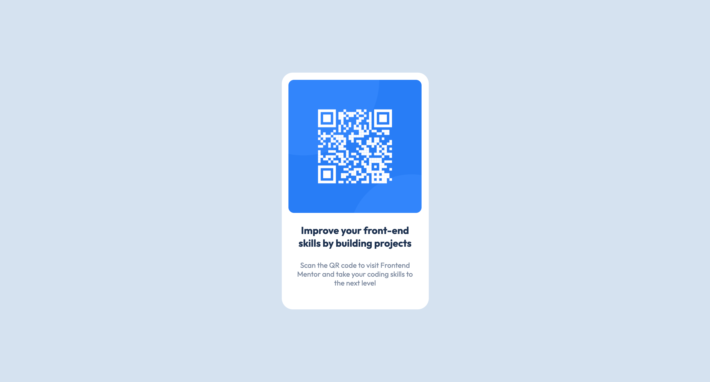

# Frontend Mentor - QR code component solution

This is my solution to the [QR code component challenge on Frontend Mentor](https://www.frontendmentor.io/challenges/qr-code-component-iux_sIO_H). Frontend Mentor challenges help you improve your coding skills by building realistic projects. 

## Table of contents

- [Overview](#overview)
    - [Screenshot](#screenshot)
    - [Links](#links)
- [My process](#my-process)
    - [Built with](#built-with)
    - [Useful resources](#useful-resources)
- [Author](#author)
- [Acknowledgments](#acknowledgments)

## Overview 

This site was fairly simple to create after the nft preview card site. :D

### Screenshot

### Links

- Live Site URL: [QR code](https://cheytes.github.io/qr-code-card/)

## My Process

### Built with

- HTML markup
- CSS custom properties
- Flexbox
- Desktop-first workflow

### Useful resources 

- [Flexbox froggy](https://flexboxfroggy.com/) - this helped me with centering my card. 

## Author

- Frontend Mentor - [@cheytes](https://www.frontendmentor.io/profile/cheytes)
- Twitter - [@chey_yte](https://twitter.com/chey_yte)
